# comfy_assemble_tags_node
2023 04-26问题修复说明：
我十分抱歉，昨天我打包时把搜索路径反显和已选路径反显的代码给覆盖掉了，今天才发现，我已经重新上传了代码到github和civitail，如果你之前有下载过，想使用这个路径反显的功能，请先到下载最新代码覆盖这个文件ComfyUI\custom_nodes\comfy_assemble_tags_node，然后去ComfyUI\web\extensions\select_tags删除这个select_tags文件夹，注意，如果你有在这个文件夹的tags.xlsx里修改或增加你的内容，请先备份，最后重启ComfyUI
# 描述
### comfy_assemble_tags_node是一个关键词选择及拼装修改插件，可以帮助你快速生成各种ai用关键词。
## 它有以下特点：
###    1、涵盖了绝大部分ai用关键词，并且做了很多分类，还包括一些常用预设等。
###    2、关键词有中文标注，方便不会英语的用户选择。
###    3、提供了搜索功能，可以快速定位关键词大概位置，可搜当前页也可全局搜索，节省时间和精力。
###    4、拥有选择记忆的功能，可以在首页看到你上一次所选择的关键词及所在路径，方便修改和调整。
###    5、可以自定义去增加关键词，满足不同的需求和喜好。
###    6、可以查看当前生成的随机种子，方便复制和分享。
###    7、可以拆分拼装关键词，如果关键词较多时建议使用拼装节点，可以让你后续想修改关键词时能更快的定位关键词位置去修改。
# 下载方式
## git
```
    git clone https://github.com/laojingwei/comfy_assemble_tags_node.git
```
## zip
[ZIP](https://github.com/laojingwei/comfy_assemble_tags_node/archive/refs/heads/main.zip)

# 安装方式
__1、将下载好的插件文件夹放到这个文件夹里 ComfyUI_windows_portable\ComfyUI\custom_nodes__
__2、重启comfyui软件，打开UI界面__

# 节点简介
### Show Seed 查看当前生成的随机种子
### Select Tags 选择关键词用的
### Assemble Tags 拼装关键词（关键词比较多且经常去修改是推荐使用）
### Show Tags 可以查看前面节点所选择的关键词，可在这里进行更详细的调整（如调整关键词后流程没监听到这里有变动，可断开与前面相连的链条再去点击生成）

# 使用方法
__1、左键双击搜索  Select Tags 、Assemble Tags  、 Show Tags 、 Show Seed  添加节点__
###    2、右键单击 __Add Node->xww->tags->...__ 选择要添加的节点
### Select Tags：
__1、可进入相应选项卡查找你所需要的关键词，也可以使用搜索进行查找，如果搜索前面加了 _\*\*_ 表示查全部选项卡的内容，查到值上面就会展示相应路径出来，不加 _\*\*_ 表示只查当前选项卡的内容，不管全局还是当前选项卡，只要查到有对应值，搜索框的文字就会转换为绿色，查不到为白色，并且对应关键词选项的右上角会出现一个箭头动画告诉你搜索的内容就是它__
__2、点击OK会把英文反显出来，这里反显内容不可更改只是为了给你看你选了什么用的__
__3、里面的内容均可自行去tags.xlsx表格里进行修改或添加__
__4、选项右边输入框为权重输入__
__5、更多详细操作请看下方截图__
###    Assemble Tags：
__1、可以配合Select Tags进行使用，也可以单独使用，当配合Select Tags使用时，请先右键在下方找到你想把哪个选项改为取输入的内容，这时就可以把Select Tags连到该选项了__
__2、里面的选项均为预设，可用可不用__
###    Show Tags：
__1、可以配合Select Tags或Assemble Tags进行关键词微调，也可以单独使用__
###     Show Seed：
__1、可以连接到VAE Decode上，流程有多少个KSampler就有多少个种子，自己选择复制相应种子使用就可；平时我们生成图片时，觉得这次生成出来的图片还不错，想在该种子的基础上稍微修改一下却没法获得这次生成的种子，因为KSampler里展示的种子会在调用后马上生成下一次的种子，这时使用这个节点就能解决你的需求了__


# 图片示例
## 效果图

## 左键双击
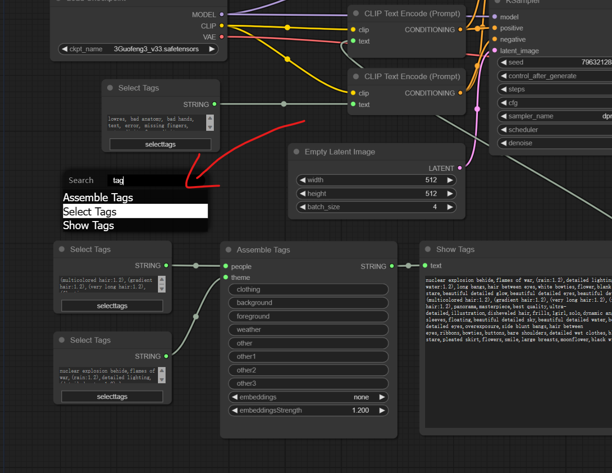
## 右键
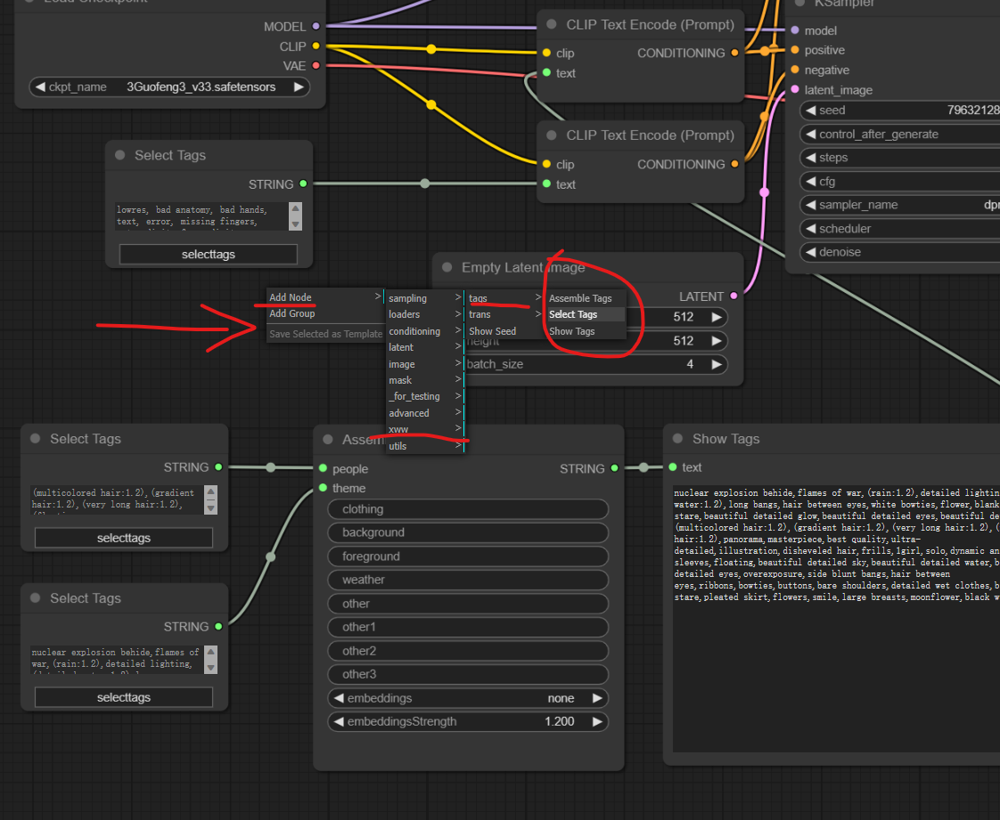
## cliptextencode打开text
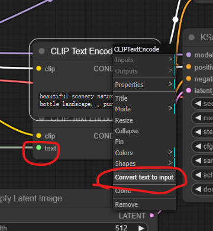
## assembletags打开text
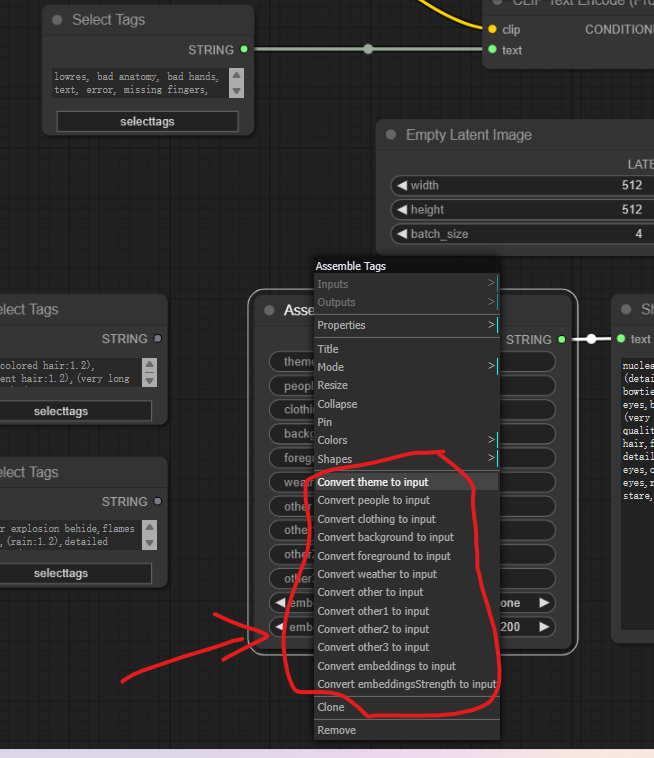
## 节点连接
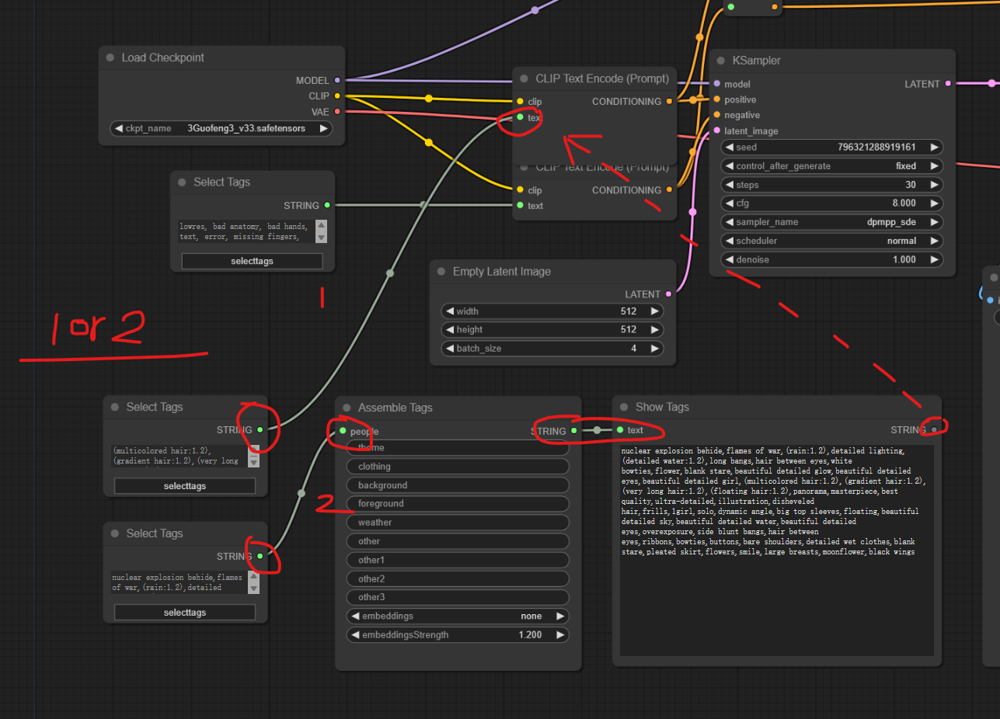
## 打开标签页
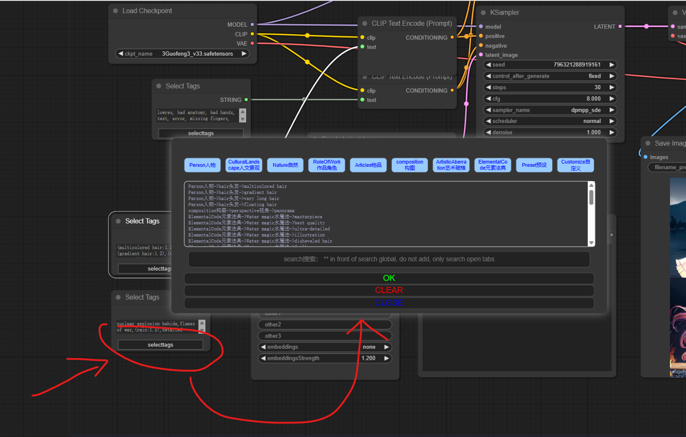
## 全局搜索
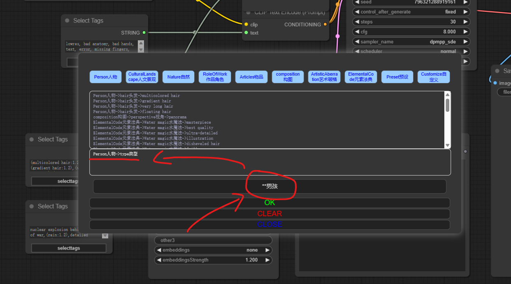
## 进入路径
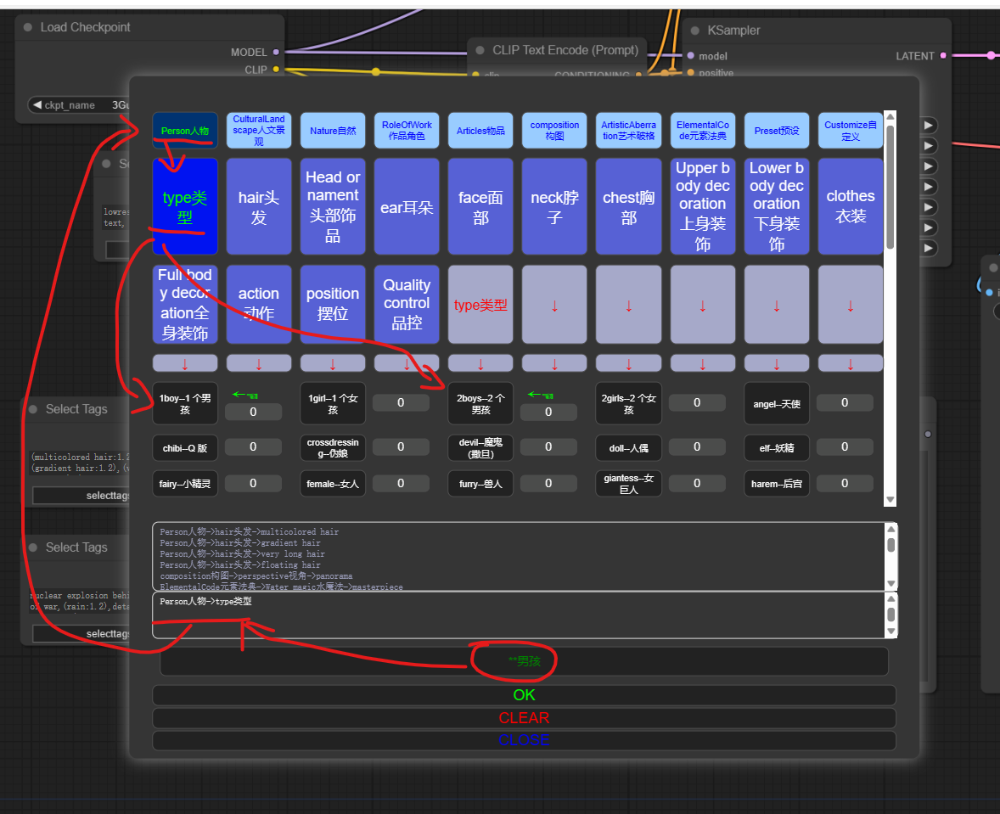
## 已选路径及选项
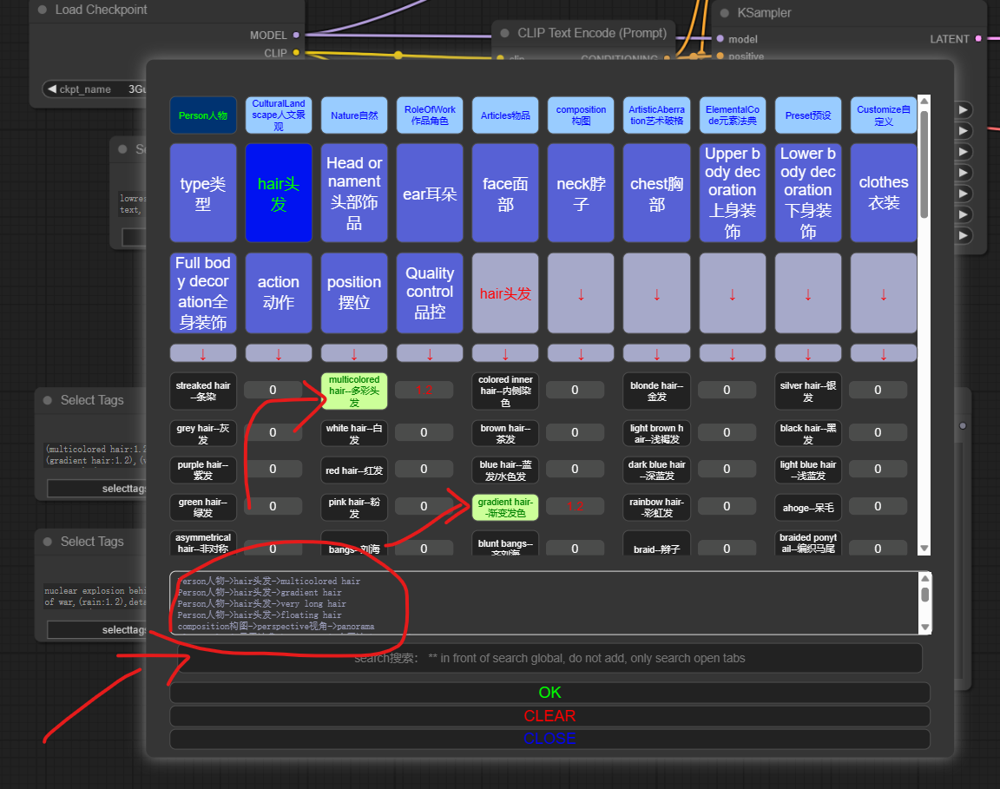
## 清空
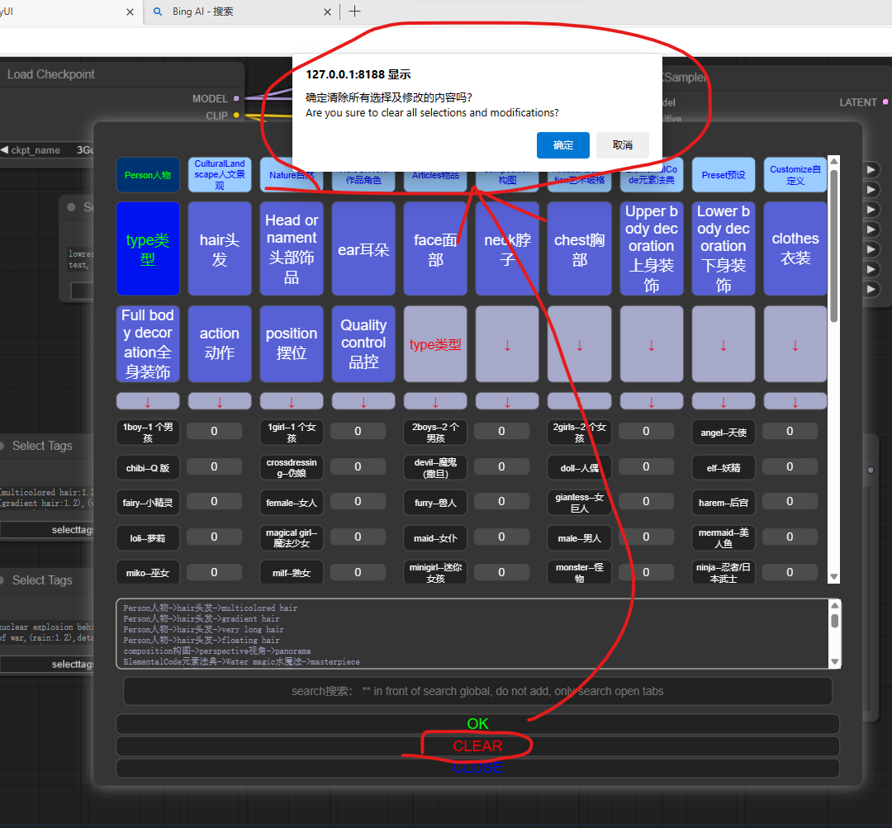
## OK
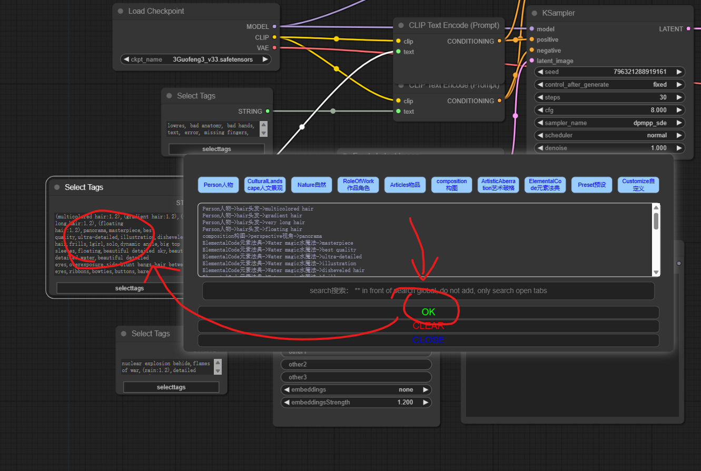
## 种子查看
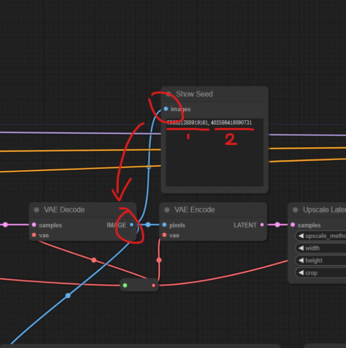
## 全流程


# 其它
1、本人的工作流[workflow.json](workflow.json)，有需要的小伙伴可以拿去直接打开
2、有需要本次效果图查看流程的，也可以在本插件的[images](./images/ComfyUI_01362_.png)里获取
3、图片我使用了放大器，如拉进去你那边报错请自行选择你所拥有的放大器去使用，模型我使用的是[国风3 GuoFeng3](https://civitai.com/models/10415/3-guofeng3)
4、本插件收集的关键词大部分来源于[wfjsw](https://github.com/wfjsw/danbooru-diffusion-prompt-builder)
5、常用预设收集于b站某up的，很久之前收集的，忘记了叫啥名字了，是一位帅哥，实在不好意思，如哪位知道的请告知我，我把他的连接加上，谢谢
6、本人所收集的数据均会表明出处，且均为可分享的内容，也不涉及任何商业利益，请大家放心使用
